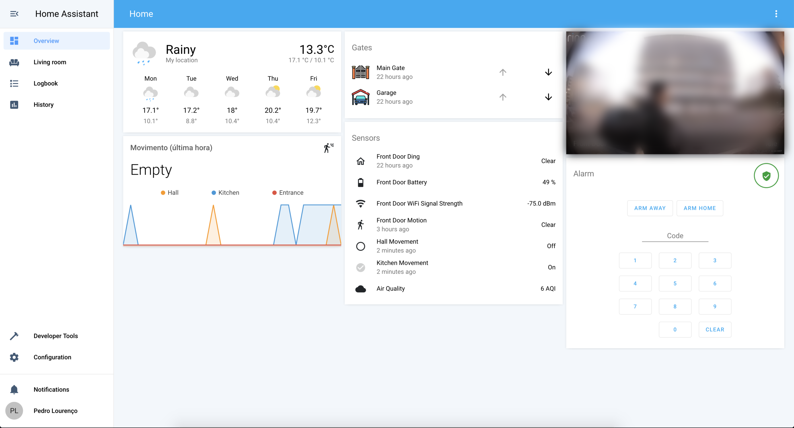

# Pedro's Smart Home

By mid-2019, after having four different apps for lights, leds, TV and vacuum cleaner respectively, I decided to it was time to find a better solution and unify all my devices into one simple controller. 

As a result, this is my smart home configuration, made with lots of effort, IoT, a couple soldering tools and home assistant. Besides integration, it also provided me the possibility of custom automations! (Such as, having all the lights in my home red if the alarm is triggered or letting me know if it's raining and say, a window is open)

## Devices

> **Disclamer:** I'm not including the shop links because most of them eventually expire. But you can easily get them using eBay, Aliexpress or any other.

### Hardware & Hubs

- Hub: [Raspberry Pi 3 B+](https://www.raspberrypi.org/) 
- Zigbee Hub (flashed with tasmota): CC2530 + CC2591 connected to a Wemos d1 mini

### Exterior

- Main gate and garage door remote controller: [Broadlink](https://www.ibroadlink.com/)
  - I'm currently using a RF transmitter, even though I plan to switch to a wired solution later on.
- Eletric lock gate: [Shelly 1](https://shop.shelly.cloud/shelly-1-wifi-smart-home-automation#50) with a 12v DC transformer
  - Previously tried a Shelly uni but its 100 mA output is insufficient to my 12v/15w (1.25A) lock

### Network

- Access Point 1: [Ubiquiti AC LR](https://www.ui.com/unifi/unifi-ap-ac-lr/)
- Access Point 2: [Cisco Meraki Go](https://www.meraki-go.com/)
- Switches (x2): [TP-Link TL-SG108E](https://www.tp-link.com/pt/business-networking/easy-smart-switch/tl-sg108e/)
- Three VLANs: Home, IOT and guests.

### Generic

- Solar panels: [Shelly 1PM](https://shop.shelly.cloud/shelly-1pm-wifi-smart-home-automation-1)
  - Controls energy production, holds up to 3.5kW while my panels peak around 0.6kw.
- Alarm panel: [Konnected Addon board](https://konnected.io/) (wish-list)
  - Essentially a board that connects all my old wired sensors together and remotely triggers the siren. This could also be acomplished with an esp32 plus shields. However, I decided to give this board a try.
- Wired sensors (x12): Generic PIR Wired Sensors (not connected yet)
- Doorbell: [Ring Doorbell 2](https://ring.com/)
  - (The only option that actually shipped free to my country).

### Hallway

- Wireless sensor (x1): [Xiaomi Aqara Body Sensor (Zigbee)](https://www.aqara.com/us/motion_sensor.html)
- Entrance lights: [Sonoff Mini](https://www.itead.cc/smart-home.html)

### Living Room

- Floor lamps (x2): [Yeelight E27 RGBW](https://en.yeelight.com/product/819.html)
- Wall dimmer: [IKEA Tradfri Dimmer (Zigbee)](https://www.ikea.com/pt/pt/catalog/products/10460751/)
- Light switch (x2): [Sonoff Mini](https://www.itead.cc/smart-home.html)
  - The sonoff's minis are used to turn the existing switches smart and allow them to control the Yeelights without cutting the power. Sonoff's will always keep the power, except if they can't communicate with the core (network is down). In such event, the relay will kick in.
- Wireless sensor: [Xiaomi Aqara Body Sensor (Zigbee)](https://www.aqara.com/us/motion_sensor.html)
- Shutter switches (x2): [Sonoff T1](https://www.itead.cc/smart-home.html) (soldering required to flash a custom firmware - [Tasmota](https://github.com/arendst/Tasmota))
- Vacuum: Xiaomi Roborock S50

### Office

- Table lamp: [Yeelight E27 RGBW]()

### Kitchen

- Shutter switches (x2): [Moes Wifi (clicky) Smart Switch]() (soldering required to flash a custom firmware - [Tasmota](https://github.com/arendst/Tasmota))
- Boiler: Thermostat using [Shelly 1](https://shop.shelly.cloud/shelly-1-wifi-smart-home-automation#50) and multiple temperature sensors in each division.
